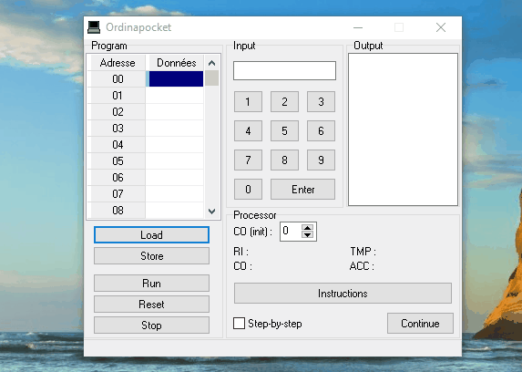

# OrdinaPocket

  <!-- Stability -->
  
  <!-- Standard -->
  

 

The OrdinaPocket is an educational tool to understand how a computer works by simulating a mini processor.

Google "ordinapoche" to get more information on the original implementation.

Date: around 2004

## Programs

- Decompose: input 123 -> ouput 1 then 2 then 3.

- Countdown: input 10 -> output 9 then 8 then 7 ... then 0

## Example

  

